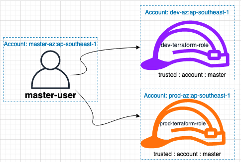

# aws-cfm-iam-assume-role-manage-policy

# Step:
## 1.Create "master-user " account at Master aws account with Administrator Access
- [master-user.yaml](./master-user.yaml)


```bash
aws cloudformation create-stack --stack-name master-user --template-body file://master-user.yaml --profile cloudideastar-master --region ap-southeast-1 --capabilities CAPABILITY_NAMED_IAM
```

## 2.Create at dev aws account for dev assume role with administrator access then trusted the master aws account
- [dev-cfm-role.yaml](./dev-cfm-role.yaml)

```bash
aws cloudformation create-stack --stack-name dev-cfm-role --template-body file://dev-cfm-role.yaml --profile cloudideastar-dev --region ap-southeast-1 --capabilities CAPABILITY_NAMED_IAM
```

## 3.Create at prod aws account for prod assume role with administrator access then trusted the master aws account
- [prod-cfm-role.yaml](./prod-cfm-role.yaml)

```bash
aws cloudformation create-stack --stack-name prod-cfm-role --template-body file://prod-cfm-role.yaml --profile cloudideastar-prod --region ap-southeast-1 --capabilities CAPABILITY_NAMED_IAM
```


